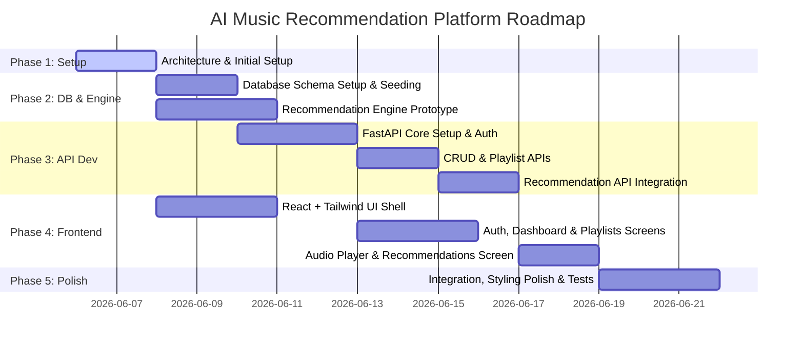

# Implementation Plan - AI Music Recommendation Platform

This document outlines the detailed architecture, database design, API specification, and development roadmap for building a production-grade AI Music Recommendation Platform.

---

## User Review Required

> [!IMPORTANT]
> **Authentication Mechanism:** We will use JWT (JSON Web Tokens) stored in secure HTTP-only cookies to mitigate CSRF and XSS attacks, rather than storing them in localStorage.
>
> **Recommendation Engine Strategy:** The engine will use a hybrid text-and-metadata feature vector (using TF-IDF on genres and artists, combined with scaled numerical features like valence, tempo, and energy) using `scikit-learn` and `pandas`.
> 
> **Database Framework:** We will use SQLAlchemy with Alembic migrations for database access and FastAPI-SQLModel integration for seamless Pydantic/SQL schema sharing.

---

## Open Questions

> [!NOTE]
> 1. **Audio Player Integration:** Do we need to stream real audio files (e.g., MP3s from AWS S3/local directory) or should we mock audio playback with a royalty-free preview link? (Proposed: Mock preview playback with hosted open-source tracks for this stage, with structured file paths ready for storage uploads).
> 2. **Seed Data:** Do we want a small synthetic dataset for testing the content-based recommendation engine, or should we ingest a standard dataset (e.g., a subset of Spotify/Million Songs)? (Proposed: Seed database with ~100 diverse popular songs covering various genres and audio features to demonstrate recommendation efficacy immediately).
> 3. **Like vs. Favorite:** How should "Like" and "Favorite" be distinguished in the UI/UX? (Proposed: "Like" acts as a thumbs-up that influences the AI recommendation engine profile vector, while "Favorite" acts as a quick bookmark to a dedicated system playlist).

---

## Complete Folder Structure

Below is the proposed directory structure for the project.

```
music-recommendation-system/
├── docker-compose.yml
├── README.md
├── docs/
│   ├── api_spec.md
│   └── database_schema.md
├── database/
│   ├── init.sql
│   └── seed_data.sql
├── backend/
│   ├── Dockerfile
│   ├── pyproject.toml
│   ├── requirements.txt
│   └── app/
│       ├── __init__.py
│       ├── main.py
│       ├── config.py
│       ├── database.py
│       ├── api/
│       │   ├── __init__.py
│       │   ├── dependencies.py
│       │   └── routes/
│       │       ├── __init__.py
│       │       ├── auth.py
│       │       ├── users.py
│       │       ├── songs.py
│       │       ├── playlists.py
│       │       └── recommendations.py
│       ├── models/
│       │   ├── __init__.py
│       │   └── domain.py         # SQLAlchemy / SQLModel models
│       ├── schemas/
│       │   ├── __init__.py
│       │   └── api_models.py     # Pydantic schemas
│       ├── services/
│       │   ├── __init__.py
│       │   ├── auth_service.py
│       │   ├── song_service.py
│       │   └── recommendation_engine.py  # Python content-based similarity engine
│       └── utils/
│           ├── __init__.py
│           └── security.py
└── frontend/
    ├── Dockerfile
    ├── index.html
    ├── package.json
    ├── tailwind.config.js
    ├── postcss.config.js
    ├── vite.config.js
    └── src/
        ├── main.jsx
        ├── App.jsx
        ├── index.css
        ├── assets/
        ├── components/
        │   ├── common/
        │   │   ├── Button.jsx
        │   │   ├── Input.jsx
        │   │   ├── Navbar.jsx
        │   │   ├── Sidebar.jsx
        │   │   └── Player.jsx
        │   ├── songs/
        │   │   ├── SongCard.jsx
        │   │   └── SongGrid.jsx
        │   ├── playlists/
        │   │   └── PlaylistModal.jsx
        │   └── recommendations/
        │       └── RecommendationList.jsx
        ├── context/
        │   ├── AuthContext.jsx
        │   └── PlayerContext.jsx
        ├── hooks/
        │   ├── useAudio.js
        │   └── useFetch.js
        ├── pages/
        │   ├── Login.jsx
        │   ├── Register.jsx
        │   ├── Dashboard.jsx
        │   ├── Library.jsx
        │   ├── PlaylistDetail.jsx
        │   └── Profile.jsx
        └── services/
            └── api.js
```

---

## Database Schema (PostgreSQL)

```mermaid
erDiagram
    USERS ||--o| USER_PROFILES : "has"
    USERS ||--o{ PLAYLISTS : "owns"
    USERS ||--o{ LIKES : "performs"
    USERS ||--o{ FAVORITES : "marks"
    
    PLAYLISTS ||--o{ PLAYLIST_SONGS : "contains"
    SONGS ||--o{ PLAYLIST_SONGS : "included in"
    SONGS ||--o{ LIKES : "liked in"
    SONGS ||--o{ FAVORITES : "favorited in"
    SONGS ||--|| SONG_FEATURES : "describes"

    USERS {
        uuid id PK
        string username UNIQUE
        string email UNIQUE
        string hashed_password
        timestamp created_at
        timestamp updated_at
    }

    USER_PROFILES {
        uuid id PK
        uuid user_id FK UNIQUE
        string display_name
        string avatar_url
        text bio
        string[] favorite_genres
    }

    SONGS {
        uuid id PK
        string title
        string artist
        string album
        integer duration_seconds
        string genre
        integer release_year
        string file_url
        string cover_art_url
        timestamp created_at
    }

    SONG_FEATURES {
        uuid song_id PK, FK
        float valence
        float energy
        float danceability
        float tempo
        float acousticness
        float instrumentalness
    }

    PLAYLISTS {
        uuid id PK
        string name
        text description
        uuid user_id FK
        boolean is_private
        string cover_art_url
        timestamp created_at
        timestamp updated_at
    }

    PLAYLIST_SONGS {
        uuid playlist_id PK, FK
        uuid song_id PK, FK
        integer position
        timestamp added_at
    }

    LIKES {
        uuid user_id PK, FK
        uuid song_id PK, FK
        timestamp created_at
    }

    FAVORITES {
        uuid user_id PK, FK
        uuid song_id PK, FK
        timestamp created_at
    }
```

---

## API Contracts

All endpoints are prefixed with `/api`. Responses are in JSON format.

### 1. Authentication
* **`POST /api/auth/register`**
  - Request: `{"username": "johndoe", "email": "john@example.com", "password": "securepassword"}`
  - Response: `201 Created` - `{"message": "User registered successfully", "user_id": "uuid"}`
* **`POST /api/auth/login`**
  - Request: `{"username": "johndoe", "password": "securepassword"}`
  - Response: `200 OK` (Sets secure HttpOnly cookie `access_token`) - `{"message": "Login successful", "user": {"id": "uuid", "username": "johndoe"}}`
* **`POST /api/auth/logout`**
  - Request: Empty
  - Response: `200 OK` (Clears JWT cookie) - `{"message": "Logged out successfully"}`

### 2. User & Profiles
* **`GET /api/users/me`** (Requires Auth)
  - Response: `200 OK` - `{"id": "uuid", "username": "johndoe", "email": "john@example.com", "profile": {"display_name": "John Doe", "avatar_url": "...", "bio": "Music lover", "favorite_genres": ["Rock", "Jazz"]}}`
* **`PUT /api/users/me`** (Requires Auth)
  - Request: `{"display_name": "John D.", "bio": "Updated bio", "favorite_genres": ["Rock", "Lo-Fi"]}`
  - Response: `200 OK` - Updated user profile details.

### 3. Song Catalog & Search
* **`GET /api/songs`**
  - Query Parameters: `search` (string), `genre` (string), `page` (int), `limit` (int)
  - Response: `200 OK` - `{"items": [{"id": "uuid", "title": "Song Title", "artist": "Artist Name", ...}], "total": 120, "page": 1, "limit": 20}`
* **`GET /api/songs/{id}`**
  - Response: `200 OK` - Detailed song data + metadata + audio features.

### 4. Likes & Favorites
* **`POST /api/songs/{id}/like`** (Requires Auth)
  - Request: Empty (toggles state)
  - Response: `200 OK` - `{"song_id": "uuid", "liked": true/false}`
* **`POST /api/songs/{id}/favorite`** (Requires Auth)
  - Request: Empty (toggles state)
  - Response: `200 OK` - `{"song_id": "uuid", "favorited": true/false}`

### 5. Playlists
* **`GET /api/playlists`** (Requires Auth)
  - Response: `200 OK` - `[{"id": "uuid", "name": "Chill Vibes", "is_private": true, "songs_count": 5}]`
* **`POST /api/playlists`** (Requires Auth)
  - Request: `{"name": "Chill Vibes", "description": "My relax list", "is_private": true}`
  - Response: `201 Created` - Playlist detail object.
* **`GET /api/playlists/{id}`**
  - Response: `200 OK` - Playlist detail including detailed array of songs.
* **`PUT /api/playlists/{id}`** (Requires Auth - Owner only)
  - Request: `{"name": "New Name", "description": "New description", "is_private": false}`
  - Response: `200 OK` - Updated playlist details.
* **`DELETE /api/playlists/{id}`** (Requires Auth - Owner only)
  - Response: `200 OK` - `{"message": "Playlist deleted successfully"}`
* **`POST /api/playlists/{id}/songs`** (Requires Auth - Owner only)
  - Request: `{"song_id": "uuid"}`
  - Response: `200 OK` - `{"message": "Song added to playlist", "playlist_id": "uuid"}`
* **`DELETE /api/playlists/{id}/songs/{song_id}`** (Requires Auth - Owner only)
  - Response: `200 OK` - `{"message": "Song removed from playlist"}`

### 6. AI Recommendations
* **`GET /api/recommendations`** (Requires Auth)
  - Query Parameters: `limit` (int, default=10)
  - Response: `200 OK` - List of recommended songs calculated from user's liked and favorited profile vectors.
* **`GET /api/songs/{id}/recommendations`**
  - Query Parameters: `limit` (int, default=5)
  - Response: `200 OK` - List of recommended songs that are similar to the specified song ID (item-to-item similarity).

---

## Development Roadmap



---

## Proposed Changes

We will perform the initial scaffolding (Phase 1) by establishing the folder structure, basic configurations, and dependencies.

### Scaffolding & Configuration

#### [NEW] [docker-compose.yml](file:///c:/Users/Aashrith/OneDrive/Aashrith/Webs/music-recommendation-system/docker-compose.yml)
Compose file to orchestrate FastAPI, React, and PostgreSQL services.

#### [NEW] [requirements.txt](file:///c:/Users/Aashrith/OneDrive/Aashrith/Webs/music-recommendation-system/backend/requirements.txt)
Python dependencies (FastAPI, uvicorn, SQLAlchemy, SQLModel, psycopg2-binary, PyJWT, passlib, scikit-learn, pandas, numpy).

#### [NEW] [pyproject.toml](file:///c:/Users/Aashrith/OneDrive/Aashrith/Webs/music-recommendation-system/backend/pyproject.toml)
Python package configuration & formatting rules.

#### [NEW] [package.json](file:///c:/Users/Aashrith/OneDrive/Aashrith/Webs/music-recommendation-system/frontend/package.json)
Frontend npm dependencies (React, Vite, TailwindCSS, Axios, Lucide React, React Router).

#### [NEW] [tailwind.config.js](file:///c:/Users/Aashrith/OneDrive/Aashrith/Webs/music-recommendation-system/frontend/tailwind.config.js)
Tailwind configurations including custom color theme tokens for the modern music UI (e.g. deep neon slate, rich violet, emerald, dark glass).

#### [NEW] [vite.config.js](file:///c:/Users/Aashrith/OneDrive/Aashrith/Webs/music-recommendation-system/frontend/vite.config.js)
Vite configurations mapping build directories and setting up proxy paths to the FastAPI backend.

---

## Verification Plan

### Automated Tests
- Build and spin up the multi-container setup: `docker compose up --build -d`
- Run DB healthcheck check: ping the PostgreSQL instance.
- Run Python linting & type checks: `flake8` and `mypy` in backend.
- Run React build check: `npm run build` inside frontend.

### Manual Verification
- Check API docs (FastAPI Swagger interface) at `http://localhost:8000/docs`.
- Check React client interface at `http://localhost:5173`.
